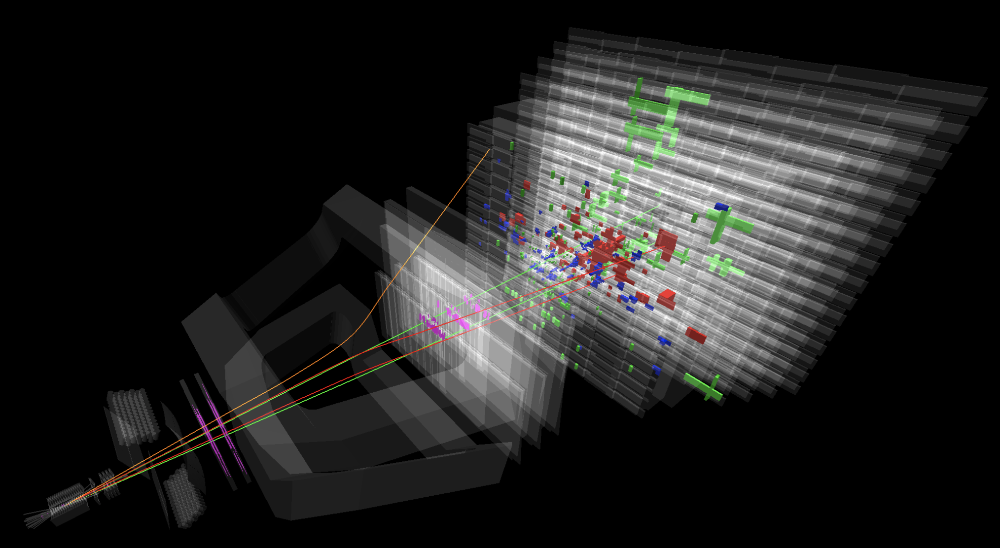
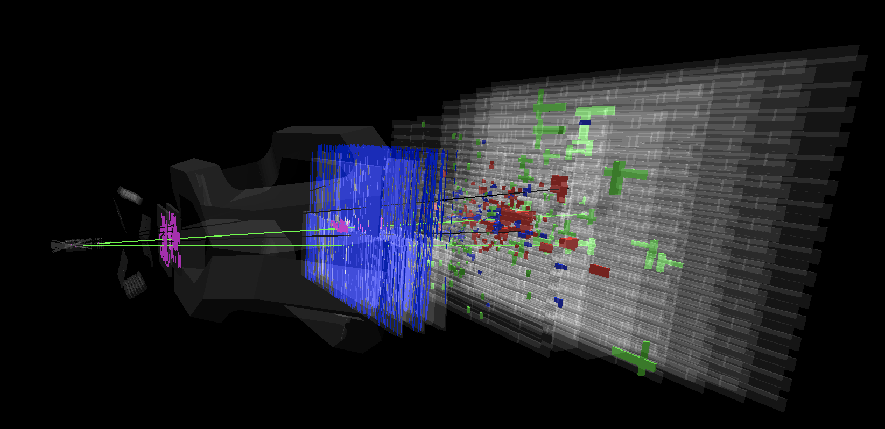

# REANA example - LHCb Monte Carlo simulation

## About

This example shows how Monte Carlo events are generated at the LHCb experiment.

## Results

Here presented are visualised events that were simulated.
These events are used in the following analysis:

### Observation of the very rare Bs->mumu

Shown in green are the two muons.

